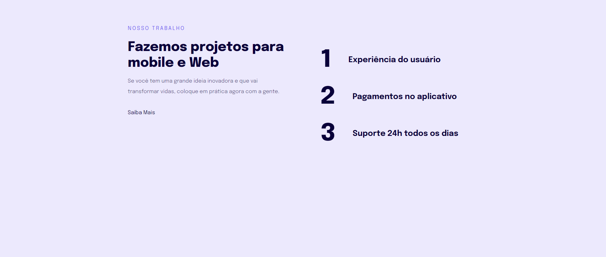

# Explorer Project 0.4 🚀

## 💻 Sobre

Projeto com HTML e CSS puro, com responsividade para mobile.

Foi desenvolvido apartir de um layout do  <a href="https://www.figma.com/file/WdVPzx2lk8E9r0dA3PpLAN/Explorer-Stage-03-Projeto-02-(Copy)?node-id=203%3A1745">Figma</a>, se tiver interesse de vizualizar o site clique <a href="https://manuelaalecio.github.io/explorer-project-04/">aqui</a>.

## 🔨 Tecologias

* HTML
* CSS
* Git

## 📄 Licensa

Este projeto está sob a licença do MIT. Consulte o arquivo [LICENSE](LICENSE) para obter mais detalhes.